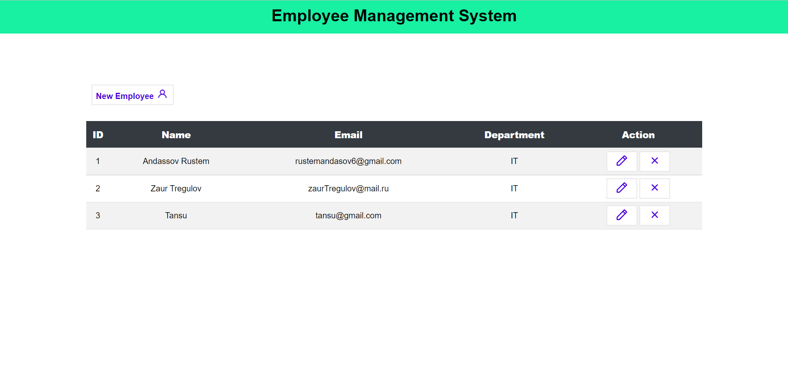
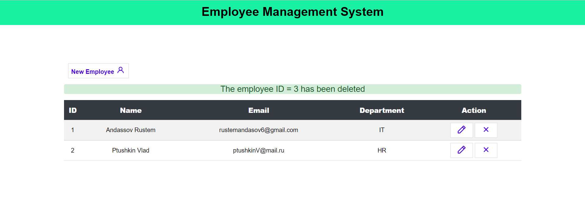
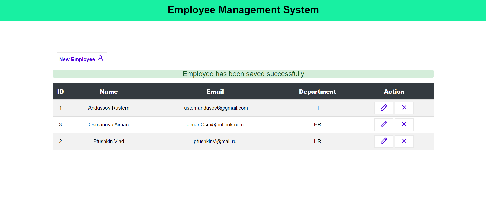

# CRUD Application

The application is dedicated to practice using Spring, Hibernate, PostgreSQL technologies.

## Employees
All employees listed in a table with buttons to add a new employee, edit employee information or delete employee from the database.

## Edit and Add forms
The form with corresponding employee ID is shown. Here the employee information can be changed and updated.

The similar form for adding a new employee.

Popping out messages in case of employee removal or update

